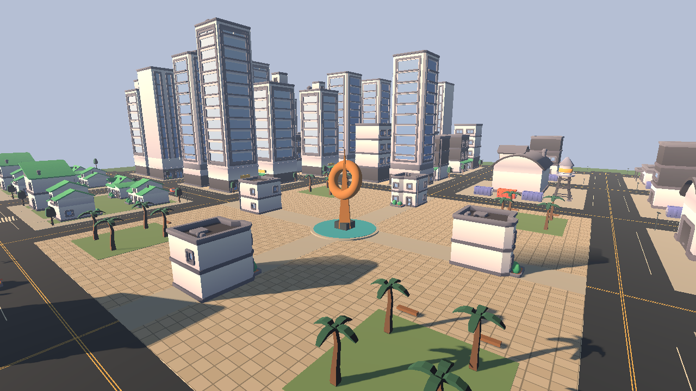
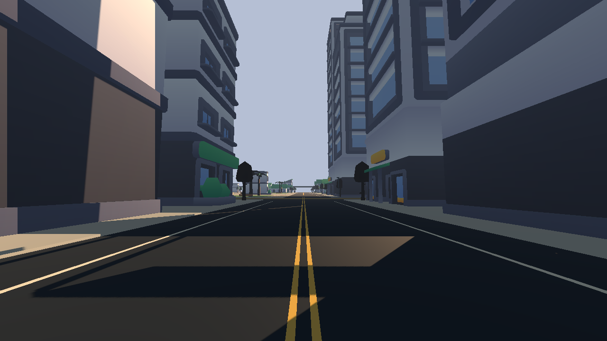
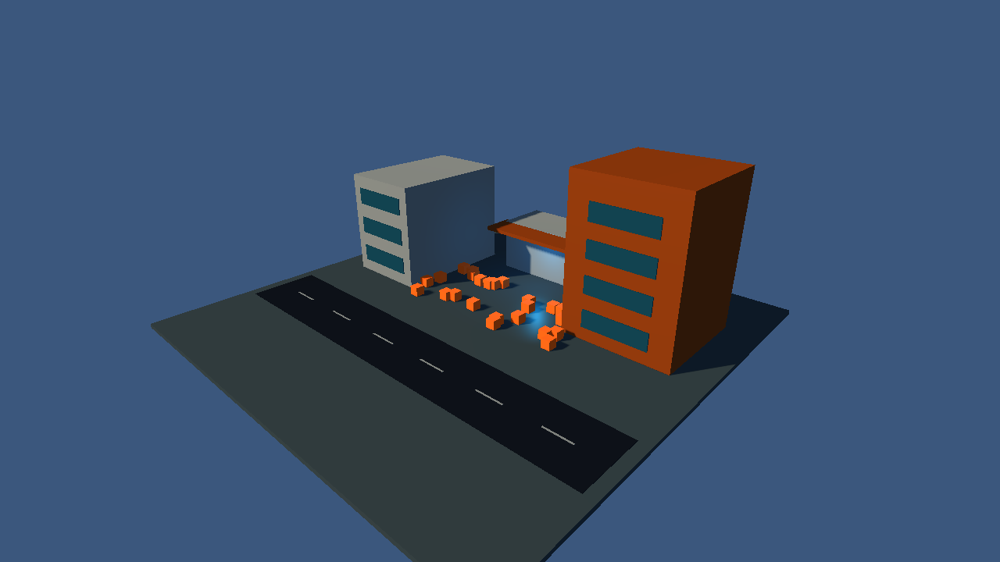

# General Godot authoring with ARCONT

Map Forge 1.3 has two controls in its Control panel: **Map contract**, and
**Godot nodes, resources and provider APIs**. Discover tools selects the second
and queries the installed engine. Both controls use ARCONT's revisioned public
CLI; recipes are authored explicitly, without an LLM endpoint or API key.

The map contract remains the source for `maps/*.json` and their generated scenes.
General scene recipes are a separate source under `authoring/documents`; editing
one never silently changes a canonical map. To change Urban Nexo's canonical
layout, continue using Map Forge's map contract API. A general recipe can load
an already materialized Urban Nexo scene and build a separate derived scene.

## Setup

Check out ARCONT's general-authoring implementation, set `ARCONT_ROOT` and
`GODOT_BIN` to the exact Godot 4.7.2-stable executable, install the pinned
providers, then import the project before authoring:

```bash
python tools/install_map_authoring_providers.py
"$GODOT_BIN" --path . --editor --headless --import
python "$ARCONT_ROOT/tools/godot_authoring_control.py" --project . --request request.json
```

The panel chooses the correct tool file automatically when ARCONT_ROOT is set.
Responses are scrollable and copyable. Open built scene opens the first saved
scene from a successful recipe in the visual editor, including preview bundles.
It inherits the running editor executable when GODOT_BIN is absent. Python 3's
`python3` executable must be available or configured in the project adapter.
Engine jobs run in a separate process and write fresh output bundles; they do
not mutate unsaved objects in the running visual editor. Save visual edits first.

## Complete APIs instead of fixed provider menus

Start with `{ "protocol_version": 1, "operation": "discover" }`. Add
`options: {"class":"NavigationMesh"}` or
`options: {"script":"res://addons/proton_scatter/src/scatter.gd"}` to inspect
actual method signatures and property metadata. Native extension classes such
as Terrain3D are discoverable through ClassDB. Provider scripts are inventoried
with hashes even when they are not advertised as global classes.

Author a recipe with explicit new/load/set/call steps. Use `$ref` for object
references and `$type` for typed Godot values. Calls can capture a returned
object/value using an `id`; later calls can reference that result. `script`
extends this for signal callbacks, typed arrays, native static APIs, provider
baking or specialised workflows. It loads a trusted project GDScript with
`run(context, arguments)`. Context exposes object/register/output_path and
normal SceneTree methods. See ARCONT's GODOT_AUTHORING_CONTROL.md for the full
protocol, transaction guarantees and MCP setup.

`options.render: true` requires a display (Xvfb in CI); headless is the default.
`options.editor: true` enters editor context for APIs requiring it. A screenshot
requires rendering and an attached Camera3D. Resource saves are bundle-relative.
Editor-context jobs remain experimental and are outside this milestone's
acceptance coverage; standalone editor startup/teardown may produce errors.
Captures, scene/resource files, WAV samples, metadata and logs are returned as
real files under `.arcont/runs`, each with artifact hashes. Open an accepted
scene path in Godot to continue manual work; export/copy its entire referenced
bundle if distributing it. Restoring a recipe rebuilds its output and changes
the head only on success.

## Reproducible integration workbench

`authoring/recipes/urban_workbench.json` explicitly composes an urban corner:
native meshes, PBR materials, warm directional shadows, blue accent lighting,
authored asset source, spatial hum and the real ProtonScatter modifier stack.
The fixture asset is a mechanical placeholder, not production vegetation.
ProtonScatter creates 24 seeded MultiMesh instances; its output is checked for
deterministic rebuild and after scene reopening. Source is MIT and pinned by
the existing provider installer; no upstream plugin code is copied into ARCONT.
The pin advances by one upstream commit to `3a9c5c1640d0270097370fc3a300bb96348bcfb6`,
which types the property-list arrays required by Godot 4.7.2. CI uses the Dummy
audio driver because its runner has no sound hardware; the authored PCM/WAV
and AudioStreamPlayer3D resource/playback state are checked separately.

```bash
python tools/godot_authoring_smoke.py --arcont "$ARCONT_ROOT"
```

The public CLI test exercises class/script discovery, dry-run, commit, invalid
method rejection, stale revision rejection, roughness patch, restoration,
rendered captures and actual MCP stdio initialization/list/call. The GDScript
extension verifies real navigation baking, a path across the scene, collision,
capsule walking, PCM audio/resource playback and save/reopen preservation.
Frame/render/memory measurements describe the authoring process on the runner.

`authoring/recipes/urban_nexo_lighting.json` also operates the existing 512m
Urban Nexo map through this bridge: it composes the actual canonical JSON and
301 asset placements, edits native sun/environment properties, tests plaza
collision, saves a separate scene and captures the plaza and street. The test
checks that the 812 authored native objects and original map bytes are preserved.
It is a lighting study, not a new canonical layout or a finished art pass.

## Verified output

Acceptance run [36952147375](https://github.com/heliossamuelhernandezreyes/Closeseal/actions/runs/36952147375)
passed with the pinned engine and provider. [provenance.json](evidence/general_authoring/provenance.json)
records source commits and file hashes; [authoring-smoke.json](evidence/general_authoring/authoring-smoke.json)
records public operations and actual checks. The complete scene bundles and logs
are in the workflow artifact. These are real engine captures:





[One-second authored industrial hum](evidence/general_authoring/industrial_hum.wav).

Terrain3D's map-specific grid/brush path remains the existing tested integration.
Cyclops and FuncGodot now have generic API access, but complete block/CSG/import
workflows still require their own acceptance scenes. Discovery alone is not a
validated feature. This milestone adds a general operational foundation; it
does not claim AAA assets, spatial acoustic simulation or target-device FPS.
