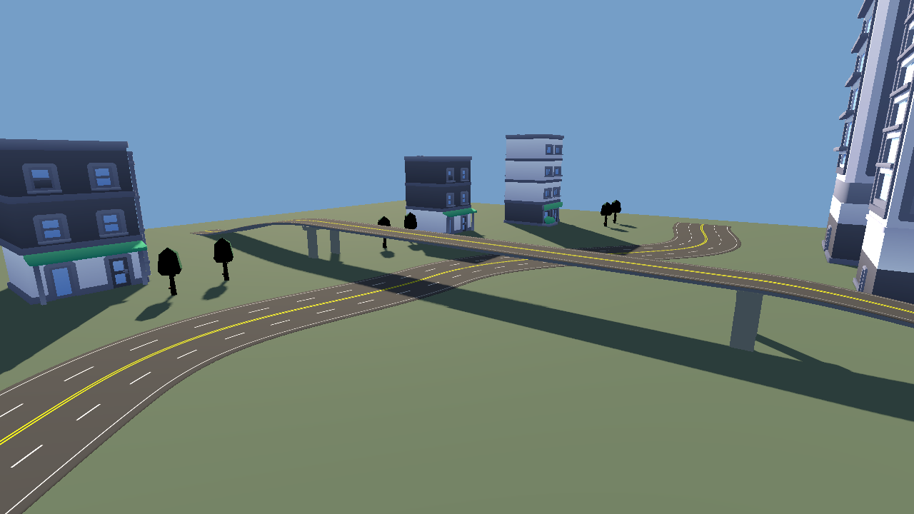
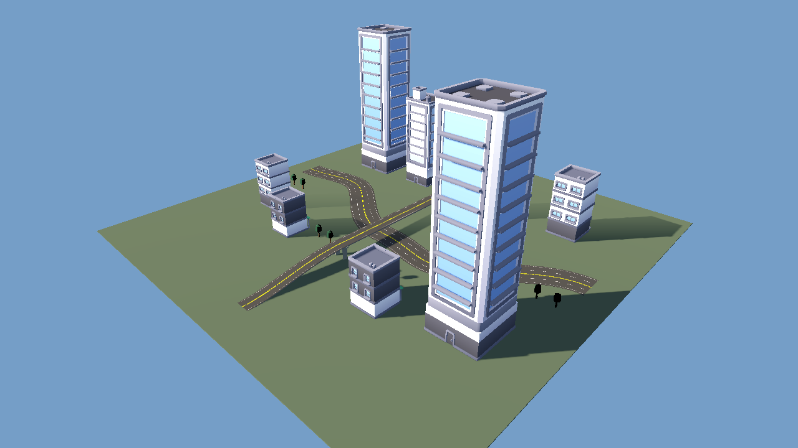

# Curved urban roads through ARCONT

`authoring/recipes/urban_roads.json` authors a four-lane curved boulevard and
a two-lane flyover with 8m deck height. Nine explicit points define seven
Bezier segments, shoulders, road thickness and 22 lane paths. Sixteen existing
Kenney CC0 game assets frame the scene; no provider demo project is copied.
This is a separate 250m district study; canonical Urban Nexo JSON is preserved.

RoadGenerator is source-pinned in `third_party/map_authoring.lock.json` at
`9d144dc4a28dd6bee870895d2b77d69174356281` (MIT). Its editor plugin is enabled
alongside Map Forge. The general authoring bridge registers every authored
RoadPoint and RoadContainer, exposing native transforms and provider methods
through `set`, `call`, discovery and trusted project-script steps. The recipe
is the revisioned source; manual scene edits must be reflected back into the
recipe to survive a recipe rebuild.

One local compatibility patch releases an unparented lane-divider gizmo template
and the Object-based connection helper during plugin shutdown. The patch, exact
upstream bytes and resulting bytes are SHA-256-pinned and checked by the installer.
It changes cleanup only; engine errors remain fatal.

```bash
python tools/install_map_authoring_providers.py
python tools/import_authoring_project.py --godot "$GODOT_BIN"
python tools/road_network_smoke.py --arcont "$ARCONT_ROOT"
```

The test runs the public ARCONT CLI: provider discovery, commit, stale and
invalid-method rejection, stable-ID position/width patch and restore. It checks
real meshes, lane connections, collision samples on both sides of joints,
navigation across both roads and a capsule moving on a curve and climbing the
ramp. Every successful build saves two bundle scenes:

- `scenes/urban_roads_editable.tscn`: original RoadPoints/connections and provider
  regeneration on reopen, with interactive editor handles.
- `scenes/urban_roads_baked.tscn`: native road meshes/collision, baked navigation,
  Path3D lane curves and scenery. RoadGenerator runtime scripts are excluded.

The generic recursive `save` operation is not used for editable provider output:
RoadSegment requires a constructor argument. The project extension deliberately
packs source nodes while excluding generated segments. Reopening independently
regenerates and compares point/mesh geometry; the baked scene tests bridge and
lower street collision with a separate layer to avoid hitting the original.
Bundles remain immutable when a recipe is patched or restored. Use the existing
Control panel to run requests; the save step returns both paths. Open the editable
path in Godot (or copy the full bundle and referenced assets for distribution).
Imported asset nodes are expanded once and retain their original source paths
as metadata. This avoids serializing external instances and their owned children
twice. The baked scene still needs the provider's MIT road texture/material
resources and the referenced game assets; it excludes provider node scripts.

On a clean checkout, import_authoring_project.py first imports texture caches
with editor plugins temporarily disabled, restores the exact project bytes in
a finally block, then imports with both plugins enabled. Both engine logs must
be free of script/resource errors. This avoids upstream UI preloads trying to
load PNG textures before Godot's first import.

For authoring, load the recipe JSON and submit `create` with
`document_id: urban_roads`, `recipe: <the full recipe object>` and
`options: {render: true, audio_driver: Dummy}`. Use `dry_run: false` to publish
after preview, then `inspect` to obtain the revision for a stable-ID `patch`.
See ARCONT's ROAD_NETWORK_AUTHORING.md for a complete patch request. The public
CLI and MCP can choose new points, lane directions, deck widths, shoulders,
heights and tangents; the example is not a fixed generator preset.

Scope limits: lane paths are navigation foundations, not traffic simulation;
terrain flattening and intersections are not enabled or accepted here. Mesh
quality and low-poly assets do not establish AAA art. CI render measurements
describe a Linux software renderer, not Android or production hardware.

## Verified output

Successful [run 36971901418](https://github.com/heliossamuelhernandezreyes/Closeseal/actions/runs/36971901418)
uses exact Godot 4.7.2 and the pinned provider plus lifecycle patch. The scene
contains 449.515m of road centreline, 7 segments/colliders, 5,968 triangles and
22 lane paths. Thirty-one samples check road surfaces/joints; native navigation
bakes 68 polygons and routes across both roads. A 1.8m capsule traverses 27.60m
of curve and 56.72m of ramp, ending at 8.05m height without teleporting.

The editable scene regenerates equal source/link/lane/mesh topology, with
measured numerical delta 0 (allowed tolerance 0.0001). The independently reopened
baked scene preserves seven meshes/colliders and both levels at 0.08m and 8.08m.
Stable-ID position/width patches change geometry; restore recreates the original
signature and preserves the earlier bundle. Original Urban Nexo bytes remain
unchanged. Both actual editor-panel opening and a real point-width edit/rebuild
pass inside the normal editor lifecycle, rejecting all engine errors.

[provenance.json](evidence/road_network/provenance.json) records code commits,
workflow/artifact and file hashes. [road-network-smoke.json](evidence/road_network/road-network-smoke.json)
contains measurements and public operations. Full editable/baked scenes and logs
are preserved in the workflow artifact. These are actual 1280x720 engine captures:



