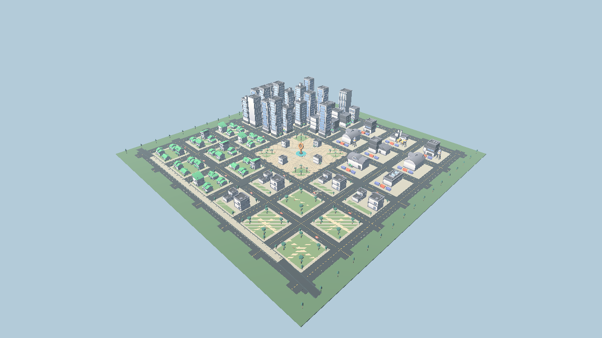
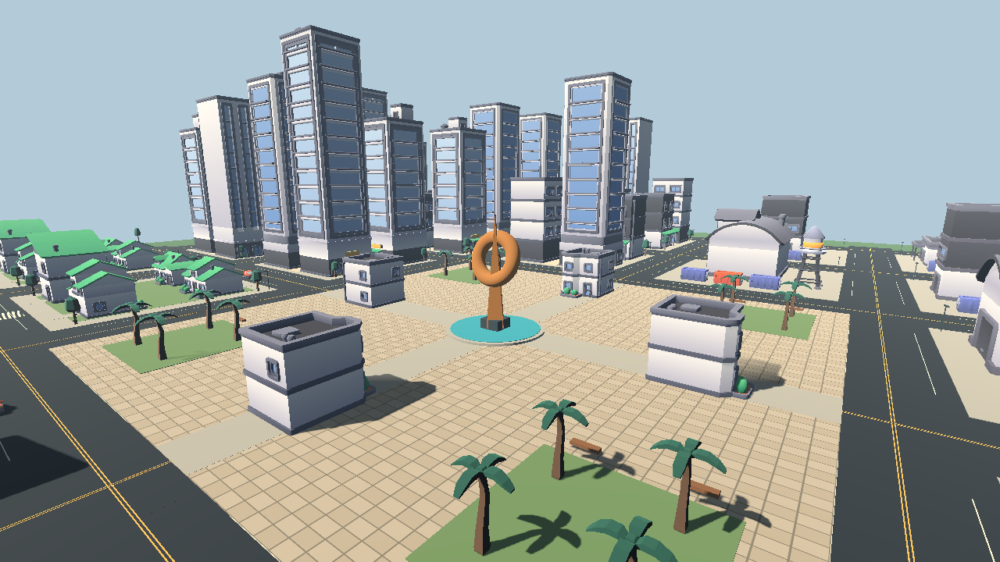
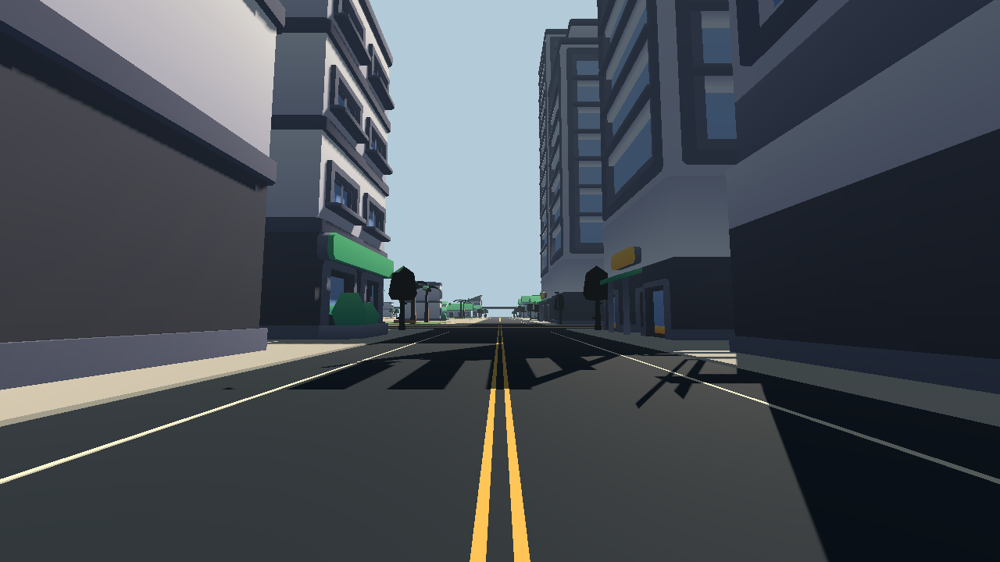
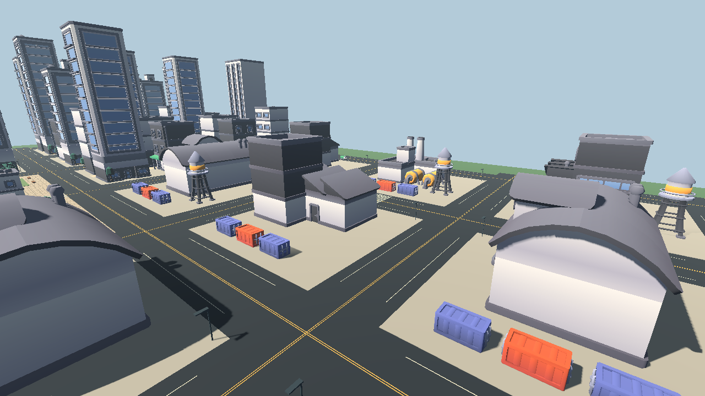
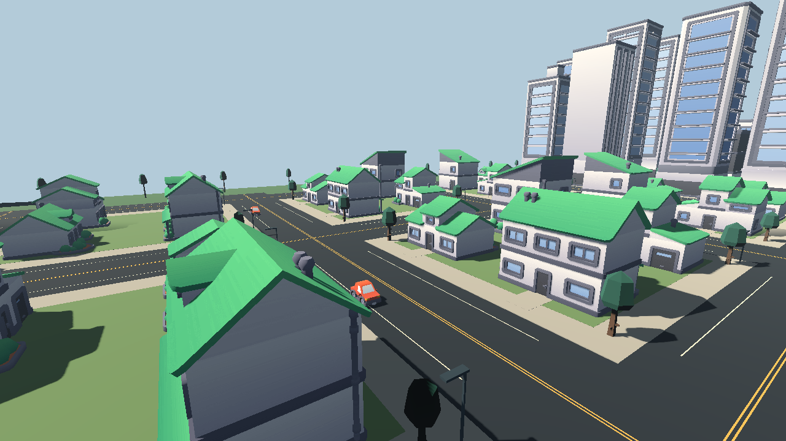
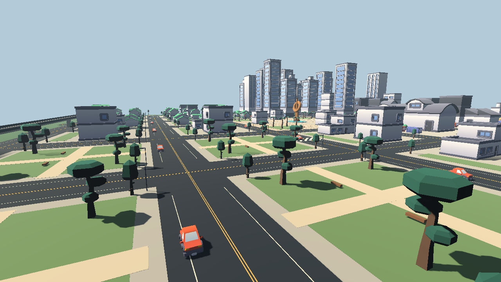
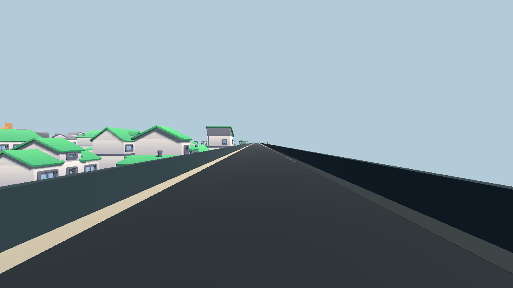
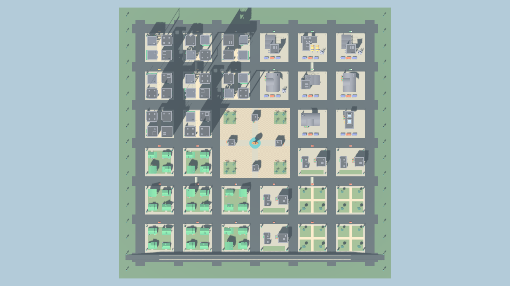

# Distrito Nexo — first urban game environment

Nexo is a fixed, authored 512 × 512 metre environment (0.262 km²), created with
Arcont's public Map Forge editor control. The canonical source is
`maps/urban_nexo_01.json`; individual instances, materials, primitive objects,
collision proxies and bridge meshes retain stable IDs for subsequent edits.

The layout contains 32 blocks, an 18 metre street network, 84 building instances,
162 trees and palms, parked vehicles, industrial loading yards and a central
pedestrian plaza. Four districts have different silhouettes and uses:

| District | Layout and landmarks |
| --- | --- |
| Commercial, northwest | Offices, tall towers and pedestrian alleys between building rows |
| Industrial, northeast | Factories, delivery vehicles, container yards and water towers |
| Residential, southwest | Detached homes, planting, gardens and driveways |
| Civic, southeast | Low commercial buildings, four linked park blocks and walking paths |

Plaza Nexo joins them with a fountain, copper monument, four shops and planted
seating areas. The southern viaduct adds a continuous route eight metres above
the street, with two 64 metre ramps and collision rails. The city has a fixed
afternoon lighting setup and eight authored inspection cameras.

## Open and explore

Use the Map Forge 1.2 branch dependency and Godot 4.7.2. Install providers with
`python tools/install_map_authoring_providers.py`, import the project, then run
`src/urban/urban_nexo.tscn` (F6 in the editor):

```bash
python tools/import_authoring_project.py --godot godot
godot --path . res://src/urban/urban_nexo.tscn
```

WASD walks; mouse looks; Shift runs; Space jumps. R returns to Plaza Nexo.
G visits the next district checkpoint. Tab switches between walking and the
city overview; Esc releases the mouse. This scene uses canonical collision
rather than a camera flying through buildings. The existing battlefield remains
available as the project's original main scene.

## Resources selected through Arcont

33 unchanged GLB models from Kenney City Kit Commercial 2.1, City Kit Industrial
2.0, City Kit Suburban 2.0, Nature Kit 1.0 and Car Kit 3.1 are committed in
`assets/urban/kenney/`, along with each source license and required color atlases.
They are used in 301 placed instances. All five packs are CC0-1.0. Arcont provided
reviewed catalogue records and authoring tools; it did not already contain these
model binaries. Production resources belong in this game repository.

`assets/urban/sources.lock.json` records Arcont catalogue IDs, source pages,
official download URLs, full archive SHA-256 values and checksums for every
committed model, texture and license. Transformed vertex bounds determined
placement scale, floor alignment and conservative collision proxies. The
original model materials are retained. `urban_asset_inventory.py` and
`prepare_urban_assets.py` document acquisition and selection, but playing the
committed city does not download assets or require an AI service.

## Edit and rebuild

Set ARCONT_ROOT to the Arcont checkout at
`c59ad6b748814ce01c56aac360060c58b8534ba8`. Use capabilities/list/inspect and the
revision-checked patch workflow in [EDITOR_CONTROL.md](EDITOR_CONTROL.md).
For example, a stable-ID edit can move one building; update its corresponding
collision proxy in the same transaction when its footprint changes.

`author_urban_nexo.py` replays this exact designed layout through public
capabilities, list, inspect, create/replace and validate operations. Running it
on an existing city intentionally replaces subsequent manual edits with that
baseline; use patch for iterative work. It contains no randomness or model call.

```bash
python tools/author_urban_nexo.py --arcont "$ARCONT_ROOT"
python tools/urban_nexo_build.py --arcont "$ARCONT_ROOT" --engine
```

The build uses Arcont inspect/validate/materialize/capture. It verifies all
committed checksums, builds a Godot scene with world navigation from the actual
static colliders, and renders overview, plaza, street, industrial, residential,
park, viaduct and orthographic plan views. Generated scenes and images live in
the workflow evidence artifact and can be reproduced from canonical JSON.

## Scope and next work

This is an explorable exterior foundation. Buildings use conservative box
proxies and have no playable interiors. Vehicles are parked props. The layout
has not yet been balanced for a particular combat mode, populated with enemies,
or measured on an Android device. The desktop exploration controls and CI
renderer do not establish mobile controls or frame rate. Art detail, interiors,
streaming/LOD, objectives and encounters should follow a concrete game design.

## Verified evidence

[Godot/Arcont run 36881895542](https://github.com/heliossamuelhernandezreyes/Closeseal/actions/runs/36881895542)
passed on code commit `7ceea016aca18d4258ee8f655e9b11b90db89030`.
The source map revision is
`473b689d2a4913256821ac2137188bea3d0d40ca8484d17df0887323e3bbc7bb`.
All eight images below are actual Godot captures of that revision.

| Check | Observed result |
| --- | --- |
| Reproduce design through Arcont | Revision-checked replacement reproduces identical canonical JSON |
| Assets | 33 source models, 301 placed instances, all 42 third-party file hashes match |
| World navigation | 3,919 polygons baked from actual static colliders |
| District connections | Plaza connects to all four districts and the viaduct; segment head rays are clear |
| Fountain avoidance | 14-point navigation detour reaches 12 m lateral clearance |
| Physical colliders | Rays hit the fountain, office, house and viaduct deck |
| Player movement | Actual 1.8 m capsule walks 6 m and stops at fountain x = 11.85 m |
| Sidewalk access | Controller crosses the 0.2 m curb and stands at y = 0.20084 m |
| Elevated access | Controller climbs the east ramp and reaches deck y = 8.00085 m |
| Import/runtime | No script errors; standalone exploration scene launches |

[Build report](evidence/urban_nexo/urban-build.json),
[traversal report](evidence/urban_nexo/urban-probe.json) and
[Arcont authoring transactions](evidence/urban_nexo/urban-authoring.json)
are preserved alongside the images. Tests cover these specific authored routes
and controller situations; they are not a mobile benchmark or combat balance test.









