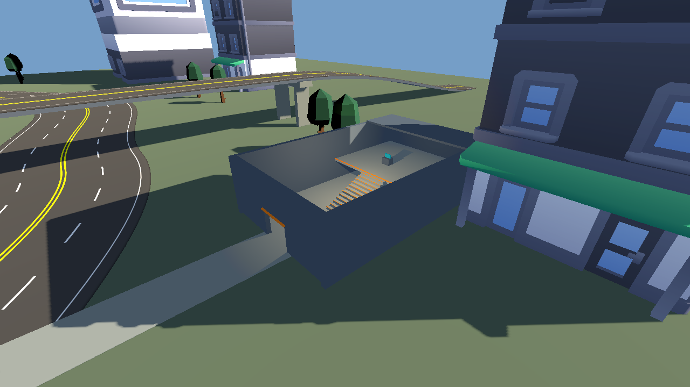
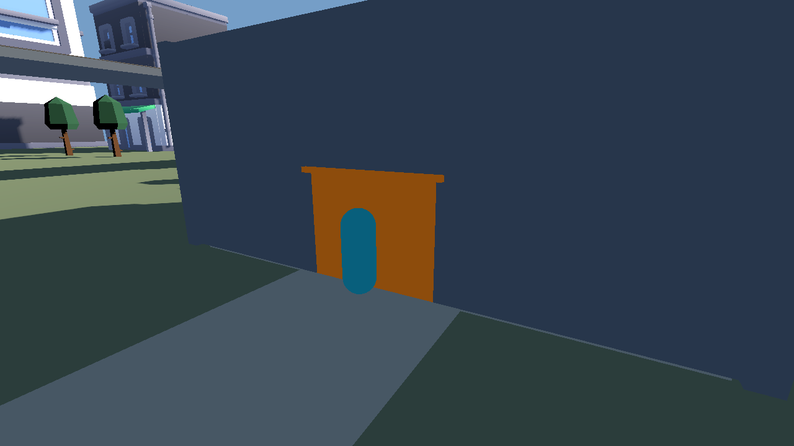
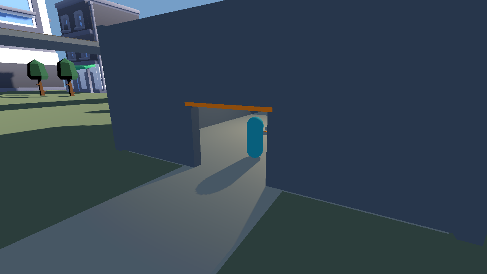
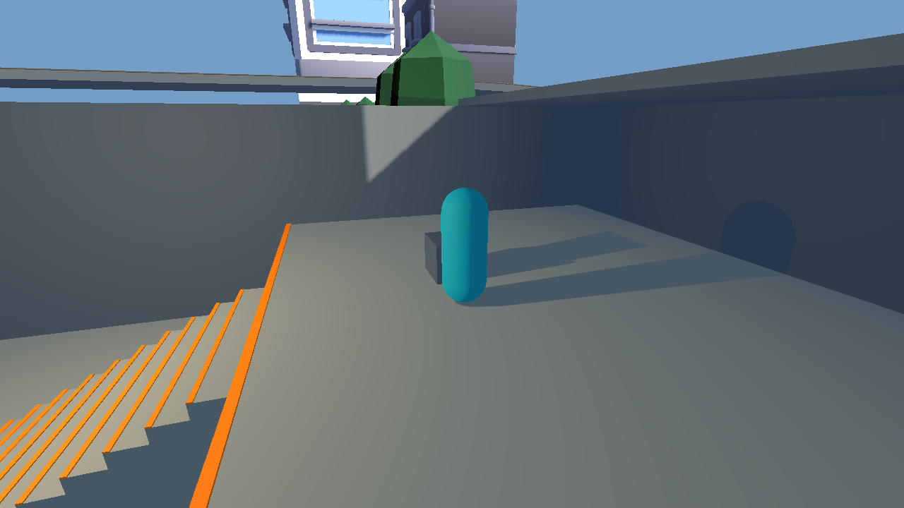

# Verified workshop input and repair loop

These are actual Godot 4.7.2 viewport captures and engine measurements from
[successful acceptance run 36989569913](https://github.com/heliossamuelhernandezreyes/Closeseal/actions/runs/36989569913).
`provenance.json` pins the game, Arcont, engine, artifact archive and selected
file hashes. The tested implementation is game commit `bd6ba460` with Arcont
commit `12c0a739`; the checkout merge commit is recorded separately.

| Same saved session | Physics ticks | Step-ups | Terminal interactions | Route reaches terminal |
| --- | ---: | ---: | ---: | --- |
| Original blocked source | 300 | 0 | 0 | No |
| Corrected source | 485 | 12 | 1 | Yes, 36 path points |
| Reopened corrected source | 485 | 12 | 1 | Yes, 36 path points |
| Restored original source | 300 | 0 | 0 | No |

The blocked position expectation fails deliberately and identifies
`door_blocker` in measured contacts. The corrected controller reaches
`[-30.000069, 2.550836, 37.892448]` after ordinary Input actions and collision
movement. Checkpoint positions in the repeated run have a measured maximum
difference of 0m; acceptance allows 0.001m on this Linux fixture. Every session
releases its input actions. Playtests preserve the document, the original scene
bundle and canonical maps. The installed editor panel reopens the accepted
workshop and successfully edits/restores a wall.

`playtest-loop-smoke.json` is the complete acceptance summary. The selected
blocked/corrected traces contain all 300/485 sequential actor samples, and
`corrected_navigation.tres` preserves the actual baked navigation mesh.
`editor-acceptance.log` contains the installed-panel acceptance marker.
Full immutable run bundles are available in the workflow artifact; reproduce
fresh bundles using the commands in [PLAYTEST_CONTROL.md](../../PLAYTEST_CONTROL.md).

This is an instrumented traversal and interaction fixture. It does not measure
production combat, enemy AI, Android performance or cross-platform determinism.
